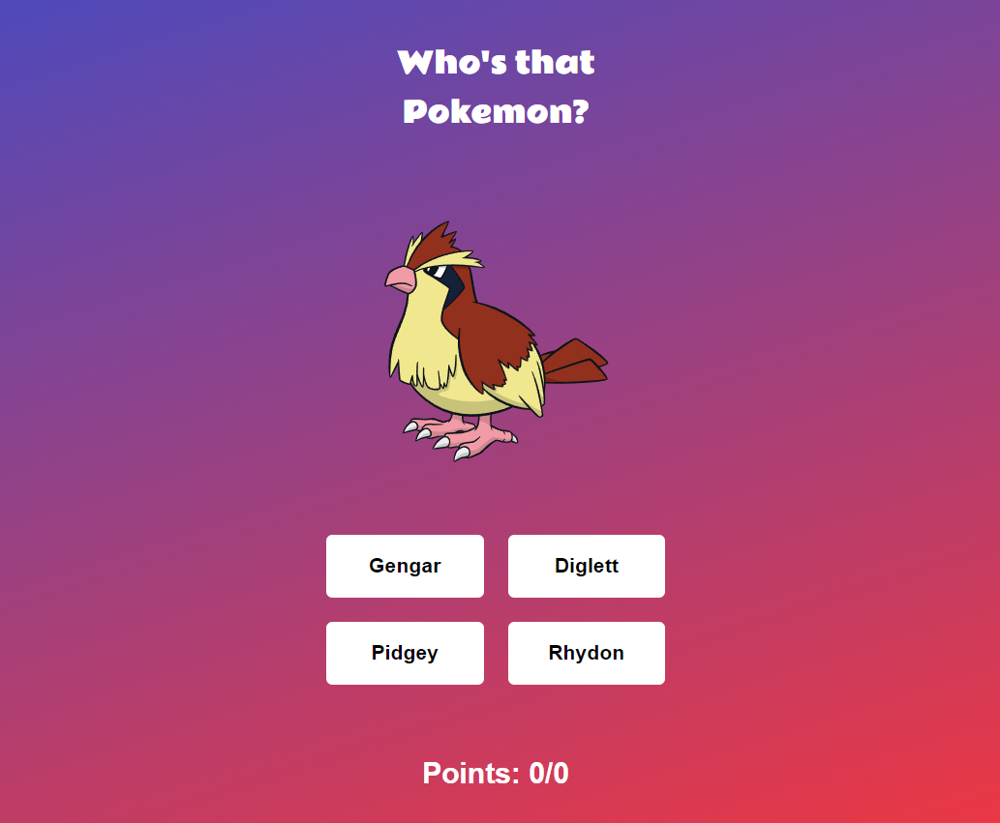
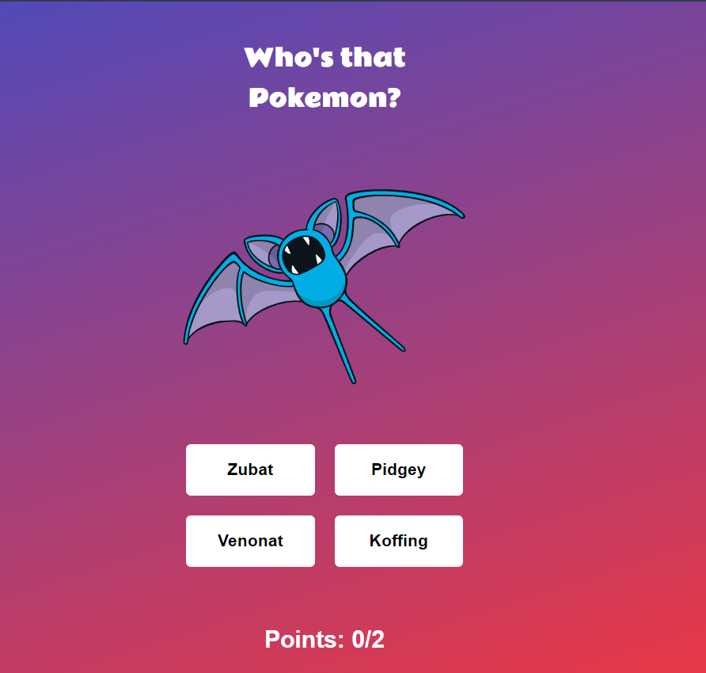

# Pokémon Quiz

This project is a web-based Pokémon quiz game where players can guess the correct Pokémon character from a list of options. It utilizes HTML, CSS, and JavaScript to create an interactive quiz experience. The Pokémon data is fetched from the [PokeAPI](https://pokeapi.co/) to provide accurate and up-to-date information.

## Features

- **Guess the Pokémon:** Players are presented with an image of a Pokémon and four options. They must select the correct Pokémon name from the options provided.
- **Score Tracking:** The quiz keeps track of the player's score throughout the game session.

- **Interactive Design:** Designed using HTML for structure, CSS for styling, and JavaScript for interactive behavior, ensuring a smooth and engaging user experience.

## Technologies Used

- HTML
- CSS
- JavaScript
- [PokeAPI](https://pokeapi.co/api/v2/pokemon/ditto) - Used to fetch Pokémon data including names and images.

## Usage

To run the project locally:

1. Clone this repository.
2. Open `index.html` in a web browser.

## Screenshots

## Demo

A live demo of the project can be found at [ Demo URL](https://wondrous-parfait-39b6e3.netlify.app/).

## Contributing

Contributions are welcome! Please fork the repository and submit a pull request with your improvements.

## License

This project is licensed under the MIT License - see the LICENSE file for details.
